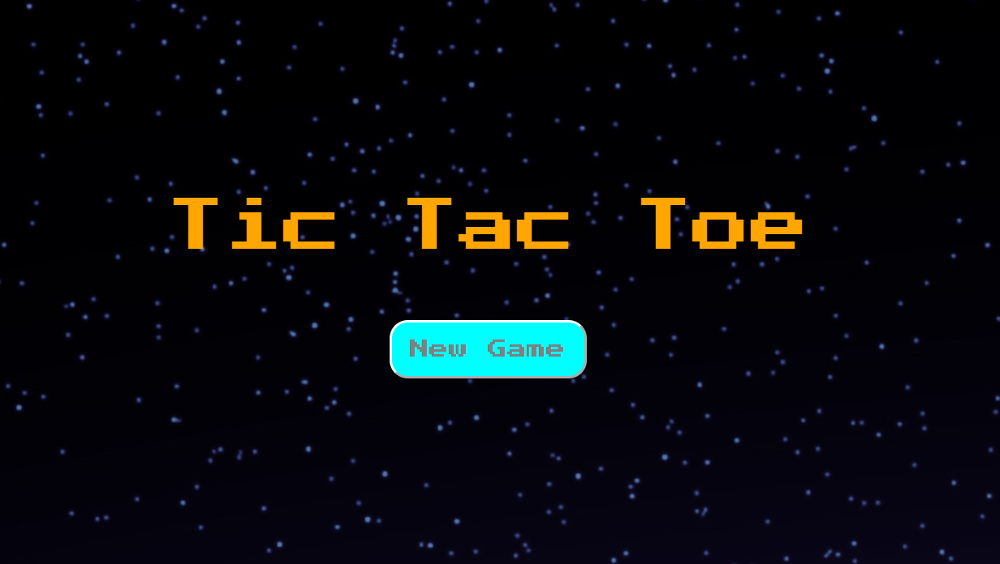
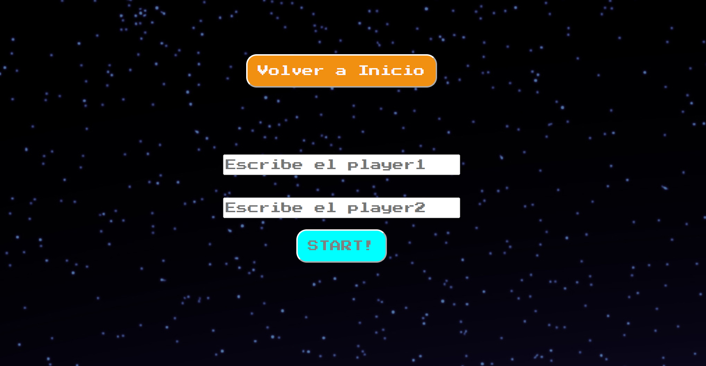
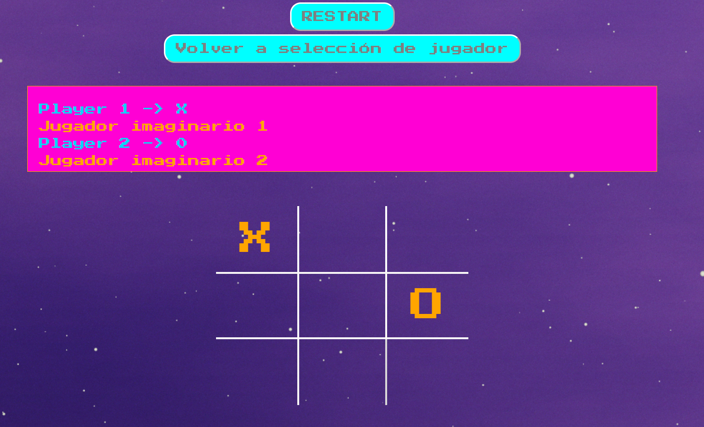
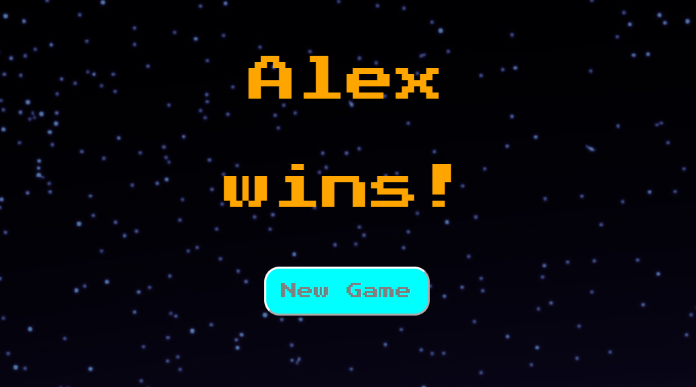

TIC TAC TOE

Hola, soy Àlex Moya, estudiante Full Stack Developer en GeeksHubs Academy.

PROYECTO:

El proyecto consiste en crear desde cero el juego Tic Tac Toe (3 En raya) y que nos permita una vez se consiga una combinación ganadora, terminar el juego. A su vez, el diseño ha de ser 100% responsive.

Comenzamos por la PÁGINA PRINCIPAL:

Al pulsar "New Game" nos lleva a la selección de jugadores.

En PLAYER SELECT, Rellenaremos los campos para poder comenzar la partida (no permitirá iniciar el juego sin los campos rellenados):

Una vez introducidos los jugadores, pulsaremos Start y nos llevará al TABLERO: 

En la interfaz del juego,  observamos un panel con la información de los jugadores y la ficha que les pertenece. En su parte inferior dispondremos del tablero, en el cual pincharemos para colocar nuestra ficha hasta un máximo de 3. En caso de no haber un ganador
podremos utilizar el botón RESTART para comenzar una partida de nuevo. En caso de querer modificar los jugadores podremos "VOLVER A SELECCIÓN DE JUGADOR" para introducir nuevos jugadores.

Si se realiza una combinación ganadora, accederemos automáticamente a la pantalla del ganador:

En ella, aparecerá el nombre del ganador. A su vez, si pulsamos el botón "NEW GAME", volveremos  a la pantalla de selección de jugadores, para comenzar si queremos una nueva partida.

Para este proyecto, se han utilizado las tecnologías HTML5, CSS3 y JavaScript.

Puedes ver este proyecto en ⇥ [GitHub pages](https://alexm0u.github.io/tic_tac_toe/)

Autor: Àlex Moya (Alexm0u)

Última vez editado: 20/02/2023
